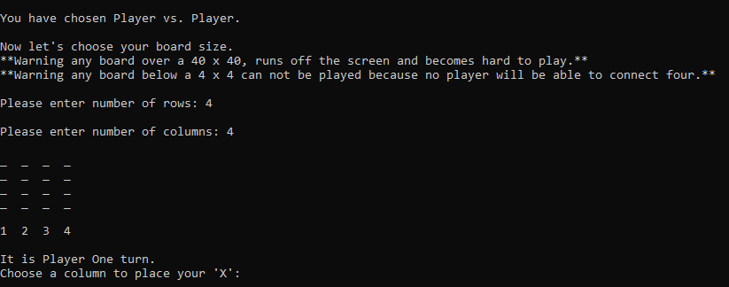
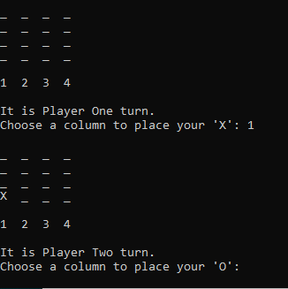
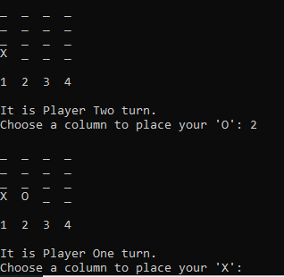
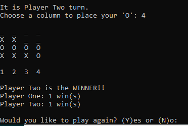
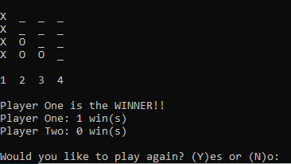
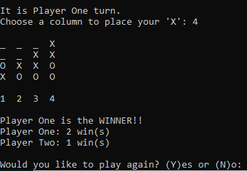
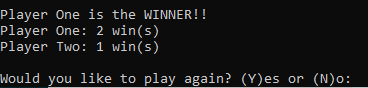
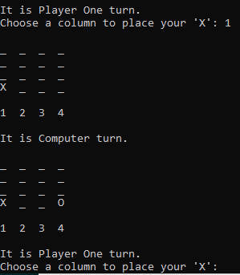

# connect4
Hello there and welcome to my version of connect4.  
As said before, I have created my own version of Connect4. I do not own the copyrights to the original Connect 4. The rules and directions are closely similar to the original. The red and blue chips will be replace with 'X' and 'O' ascii characters. The player will have two game options. Per usual the player to connect four of their ascii characters in a row horizonally, vertically, and/or diagonally first wins.  
Below I have provided a link to demonstrate how the game is operated. 
Video: https://youtu.be/GPlYYzY8Uns
  
Now let's begin. 
Assuming you are in my github, if not https://github.com/kristade/connect4 , you will need to click the "Clone or download" as seen below.
 

  
You will then download the github as a zipfile, and place it into your compiler file to be compiled. 
Once you are inside your compiler terminal and have the game files ready, you can type "make" in order to compile the code for the game.
For example: 

  
Once the code compiles, you will then type "./connect4" to actually run the game. 

  
You are now playing connect4 ascii style. It will give you the basic instructions of the game, and then prompt the user for a "Player mode". The user has the option of "Player vs Player" and "Player vs Computer". You can type 'p' or 'P' for Player vs Player option and 'c' or 'C' for Player vs Computer option. Player one will always go first for either option. If the user does not select one of the 'p' or 'c' as an option, they will be asked to re-enter until it is correct.  
Example of Player vs Player. 

  
Example of Player vs Computer. 

  
After selecting the Player Mode, Player vs Player in the example bleow, the user will be prompted to choose a board size. It will advise that a board under a 4x4 or over 40x40 will be difficult to play. It will first ask the user to enter a number for rows, and then another number for columns. If the user does not enter a valid number, they will be asked to re-enter until they enter a valid number. It will then print an empty board with the corresponding column number under each column.  
If the user enters a 4x4

  
Player One always goes first, and Player One is always 'X'. The user will be prompted to choose a column to drop their ascii into. In the exmaple below, Player One chose column 1 to place their 'X. 

  
If the Player mode is on Player vs Player, the game will then prompt Player Two do the same as Player One did, and select a column. If they enter an invalid key or a number not in the range of columns, they will be asked to re-enter until it s correct.  
Player Two choosing a column. 

  
There are three ways to connect4.  
Horizontally. 

  
Vertically. 

  
Diagonally. 

  
The players can play multiple matches with the same board size. Each time a player wins, they get one point added to their overall record. And after each game they will be asked if they want to play another match. If yes, they will start with another empty board, but their record will not reset, being able to keep score.  
In the example Player One and Player Two have played three matches, and Player One has won two of those matches, while Player Two has only won one. 

  
Say you are in Player vs Computer mode, Player One will still have the same options as in Player vs Player mode, but this time player against a computer programmed to win. Each time after Player One plays, the computer will automatically play it's next best move, as seen below. 

  
