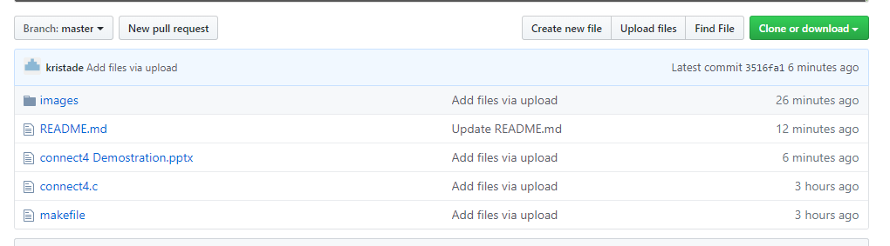
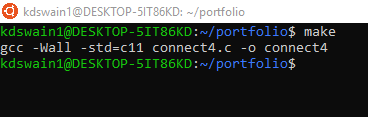
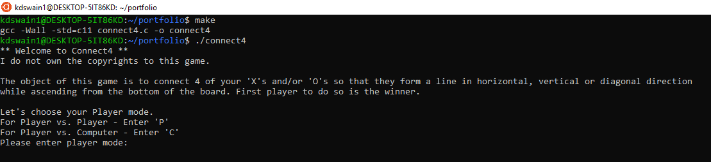
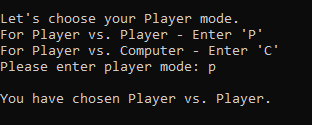
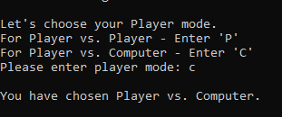

# connect4
Hello there and welcome to my version of connect4.  
As said before, I have created my own version of Connect4. I do not own the copyrights to the original Connect 4. The rules and directions are closely similar to the original. The red and blue chips will be replace with 'X' and 'O' ascii characters. The player will have two game options. Per usual the player to connect four of their ascii characters in a row horizonally, vertically, and/or diagonally first wins.  
Below I have provided a link to demonstrate how the game is operated. 
Video: https://youtu.be/GPlYYzY8Uns
  
Now let's begin. 
Assuming you are in my github, if not https://github.com/kristade/connect4 , you will need to click the "Clone or download" as seen below.
 

  
You will then download the github as a zipfile, and place it into your compiler file to be compiled. 
Once you are inside your compiler terminal and have the game files ready, you can type "make" in order to compile the code for the game.
For example: 

  
Once the code compiles, you will then type "./connect4" to actually run the game. 

  
You are now playing connect4 ascii style. It will give you the basic instructions of the game, and then prompt the user for a "Player mode". The user has the option of "Player vs Player" and "Player vs Computer". You can type 'p' or 'P' for Player vs Player option and 'c' or 'C' for Player vs Computer option. Player one will always go first for either option. 
Example of Player vs Player. 

  
Example of Player vs Computer. 

